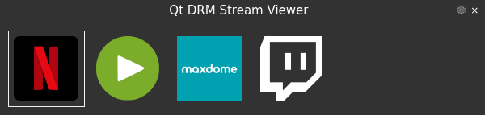
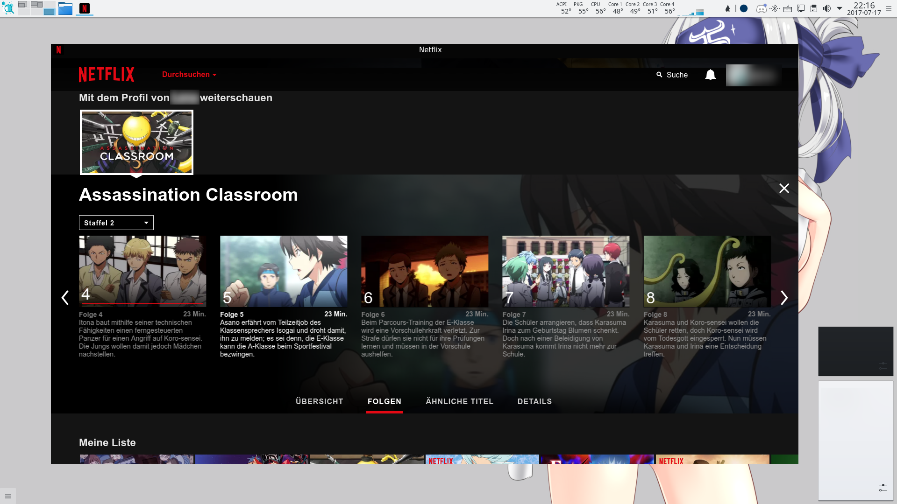

# Lightweight Qt DRM Stream Viewer

This application uses the [Qt Web Engine](https://wiki.qt.io/QtWebEngine) to implement a tiny and lightweight as possible way to view **DRM** (Digital Rights Management) streams (*Netflix, Amazon Video, Maxdome, etc.*) without any useless UI clutter which the average web browser is made of.


#### Background

I made this for the only purpose to have something to watch (mainly) Netflix which doesn't kill my RAM and generates a lot of useless CPU usage. Using a full featured Browser with a lot of UI elements and tons of other features is just nonsense for this purpose. As well that browsers have a UI full of the usual web navigation stuff which is just disturbing.

In the past I used Chrome (in `--app=... --kiosk` mode) but it spawns just too many different processes (10 tbh) with tons of threads (60+) I really don't understand what they are good for. On my laptop the total memory usage of all processes was over 4GB.

One day I had enough of this nonsense and attempted to try something out with Qt and its Web Engine. Since I mainly develop in Qt this became very handy. Now this app was born. The total number of processes now is 4 (3 of `QtWebEngineProcess` [PepperFlash, Renderer, Zygote] and the main app process) with a total memory usage of just about 300MB maximum and about 20 threads. Over 1333% difference! That's a lot.

I'm releasing this here on GitHub in case anyone else is looking for web browser alternative to watch Netflix, Amazon and what not :D

### Requirements

- Qt 5.9+
- Qt Web Engine built with proprietary codeces!! (important) <br>
  [`WEBENGINE_CONFIG+=use_proprietary_codecs`](https://blog.qt.io/blog/2016/06/03/netflix-qt-webengine-5-7/)
- Adobe **PepperFlash** and the [**Widevine Content Decryptor**](https://www.widevine.com/) (both are included in Google Chrome, download and extract the following files - no need to install the whole browser)
  - `/opt/google/chrome/PepperFlash` (the whole folder)
  - `/opt/google/chrome/libwidevinecdm.so`
  - `/opt/google/chrome/libwidevinecdmadapter.so`
- To build: CMake 3.8+, Qt build tools and development headers and a C++14 compiler
  - CLI: `cd build && cmake -DCMAKE_BUILD_TYPE=Release ..`, `make`

**Note:** On some Linux distros you can find PepperFlash in the repositories for easy installation. You still need to download Widevine manually. Due to licensing issues I can't mirror it here.

Qt is looking for PepperFlash at the following locations: *see the* [*Qt Web Engine Features*](https://doc.qt.io/qt-5/qtwebengine-features.html#pepper-flash-player-plugin-support) *overview for a detailed list of paths*

Widevine must be obtained using Google Chrome, grep it from their Website. Qt is looking for it in either its plugin location or the browsers default install location.

##### Arch Linux

Just install `pepper-flash` and `qt5-webengine-widevine`<sup>[AUR](https://aur.archlinux.org/packages/qt5-webengine-widevine/)</sup> to get started.

##### Hint about possible random crashes (if you encounter one)

See [this comment for details](https://github.com/magiruuvelvet/LightweightQtDRMStreamViewer/issues/3#issuecomment-377531975). Adding `--disable-seccomp-filter-sandbox` to the app command line is a workaround to this issue. Only enable this if you actually suffer from random crashes.

## Main Interface



The main interface is just made of a client-side title bar, a really tiny close button (can you spot it?) and the list of streaming services. The theme is hard-coded and dark. Personally I prefer light themes but because so many people like dark colors I made it dark. That way I can easily spot the window on my desktop xD

*Note: Services needs to be added manually. See below how.*


## Usage

#### Adding Services to the list

Run the app for at least once (optionally from a terminal). It will create its configuration directory and tell you where it is.

Default is `~/.config/LightweightQtDRMStreamViewer` (on Linux) and `%LOCALAPPDATA%/LightweightQtDRMStreamViewer` (on Windows).

A global system configuration is also supported.
 - `/usr/share/LightweightQtDRMStreamViewer` on \*NIX
 - exe location on Windows

Once in the config directory there should be a `providers` subfolder in there (create if it doesn't exist). Inside that directory the app is looking for streaming services to generate the list in the user interface.

All files with the `.p` extension are parsed in alphabetically order. Prepand numbers to the filenames like `01-provider1.p, 02-provider2.p, 0n-providerN.p` to sort the list in the user interface to your liking.

A provider file looks like this:
```plain
name:Netflix
icon:netflix.svgz
url:https://www.netflix.com
```

Lines starting with a hash (`#`) are ignored.

##### Options

 - `name` (required):
   Sets the display name of the provider. Used in the main UI and as window title.

 - `icon` (optional):
   Sets the display icon of the provider. Used in the main UI and as window icon. If this field is omitted the window icon will be blank and the main UI shows the `name` instead of an icon.

 - `url` (required):
   The base URL the browser window should load. Set the root URL of the streaming service there.

 - `urlInterceptor` (optional, `true/false`, disabled by default):
   Hijacks (redirects) specific links by regular expression and loads external sources. This is the master switch to enable/disable all given patterns. See the next 2 options on how to set up new patterns and targets. The Netflix sample config file provides a good example on how to use this feature. It injects a 1080p unlocker script to enjoy your shows in Full HD.

 - `urlInterceptorPattern` (optional, requires a following `urlInterceptorTarget` afterwards, *stackable*):
   Sets a regular expression to hijack specific URLs and redirect them to something else. You can add as many patterns as you want. Regular expressions must be in a [`QRegExp`](https://doc.qt.io/qt-5/qregexp.html#details) compatible format. The new Perl compatible format is not supported!

 - `urlInterceptorTarget` (optional, requires a `urlInterceptorPattern` beforehand, *stackable*):
   Sets a valid target URL (usually http) to what a matched pattern should redirect. You can add as many target URLs as you want. There is no "error" detection so make sure the target links are valid.

 - `httpAcceptLanguage` (optional, requires `urlInterceptor` to be enabled):
   If set, sends the HTTP `Accept-Language` header in all requests with the given content.

 - `script` (optional, format=`filename,injection_point(optional)`, *stackable*):
   A JavaScript file to inject into all pages of the current profile. This option can be stacked, which means added multiple times in a row. The app maintains a list internally and loads the scripts in the order of appearance. See **Script Injection** below for more usage details.

 - `user-agent` (optional):
   Overrides the default Qt Web Engine user-agent and the ARM detection user-agent. Set your custom HTTP user-agent there. If the string is empty it falls back to auto detect.

 - `titlebar` (optional, default is `false`):
   Set to `true` to show a client-side title bar for the browser window. The title bar can be used to move the window when your window manager doesn't support movement of frameless windows.

 - `titlebar-text` (optional):
   Sets a permanent window title which never changes. Value can be empty to remove the window title. By default the title is constructed from the websites HTML `<title>` plus the providers `name` field separated by `─` and constantly changes depending on the current HTML loaded in the browser window.

 - `titlebar-color` (optional, default is `#323232`):
   Colorize the title bar to match the primary color of the streaming website (example: Netflix has `#060606` on the very top).

 - `titlebar-text-color` (optional, default is `#ffffff`):
   Sets the title bar text color to keep it readable on the specified background color.


#### Command line arguments

There are command line arguments to skip the main UI and load straight into the browser window to start watching.

- `--fullscreen`, `-fs`: starts the browser window in fullscreen mode (the main UI is not affected by this)
- `--provider={id}`: specify the streaming service to start
  - the `{id}` is the filename without the `.p` extension.

For my part I added this command line arguments mainly to skip the UI to create `.desktop` files to straight start watching without unnecessary clicks. The UI is just there for an overview :D

*Hint: Setting a valid icon for a provider makes it the window icon which is shown in the task bar.*

#### Shortcuts & Navigation

##### Browser Window

- `Ctrl+F` toggle fullscreen mode
- `Ctrl+Q` close browser window / or exit application when the main ui was skipped
- `F1` toggles the address bar visibility (can also be used to change the URL; use with caution)
- `F5` reload page (sometimes needed on Netflix when the player crashes)
- `Ctrl+F5` clear cache and reload page (force reload)

The application is completely frameless, while the main UI should be movable, the browser window is not. If you use window managers like KDE/KWin, Compiz or any tiling window manager this is no problem at all. On Windows you may want to take a look at the `titlebar` option (see above).

## Hacks

A useful list of hacks you can make use of.

 - [Netflix 1080p Unlocker](https://github.com/magiruuvelvet/netflix-1080p)


## Script Injection

This app supports the injection of UserScripts into web pages. The format is `filename,injection_point(optional)`, which means you may not have a comma sign (`,`) in filenames. Filenames can be relative to the current provider file or absolute.

#### Injection Points

This is an optional value. The default injection point is `auto` when this option is omitted.

 - `create`: The script will be executed as soon as the document is created. This is not suitable for any DOM operation.
 - `ready`: The script will run as soon as the DOM is ready. This is equivalent to the DOMContentLoaded event firing in JavaScript.
 - `defer`: The script will run when the page load finishes, or 500ms after the document is ready, whichever comes first.
 - `auto`: Let the user script decide when to run. `@run-at` option in Greasemonkey scripts ─ compatible with Qt.

#### Important Notice

Make sure your script filename ends with `.user.js` when working with UserScripts. Apparently this makes a difference when the Qt Web Engine parses JavaScript files.


## Browser Profiles and Caches

Every provider has its very own browser profile and caches. They are located in the `WebEngineProfiles` subfolder in the configuration directory. Additionally Qt also stores data into the generic data path of your OS under `LightweightQtDRMStreamViewer/QtWebEngine`. On XDG platforms this is `~/.local/share` and on Windows its the `AppData` directory.

Login credentials are remembered if you tick that "Remember me" checkbox. No need to login every single time :)

#### Disclaimer

The Qt Web Engine has plenty of settings. I tweaked the settings to be sufficient and optimized for streaming. Please do **not** use this app as a regular web browser! You have been warned.


## Credits

 - App Icon:
   [movie protected](https://thenounproject.com/search/?q=movie&i=556272) by arjuazka from the Noun Project


## Screenshots

### Netflix as *"dedicated"* app <sup>(not really `:^)`)</sup>


